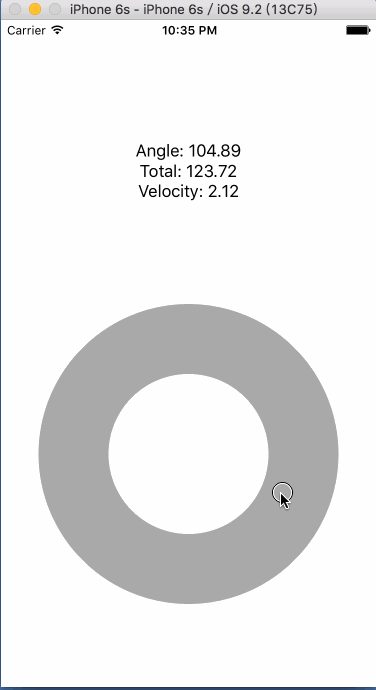

# WSDCircleGestureRecognizer
A Custom UIGestureRecognizer for circle touching

This is developed based on [Michael Teeuw's XMCircleGestureRecognizer](https://github.com/MichMich/XMCircleGestureRecognizer).

## What's the differences?

I made some modifications according to my requirements, including:

* Change the start angle position
* Change anti-clockwise to clockwise
* Add a **total** to represent the accumulated angles
* Add a **velocity** to represent the velocity of moving gesture
* Remove **distance** and **value**

## Demo

## How to use

The code is very easy so please just check the code or see the instruction on [XMCircleGestureRecognizer](https://github.com/MichMich/XMCircleGestureRecognizer).

## License
MIT
